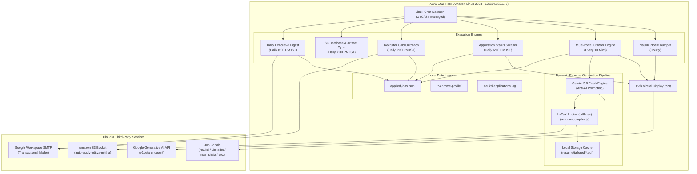
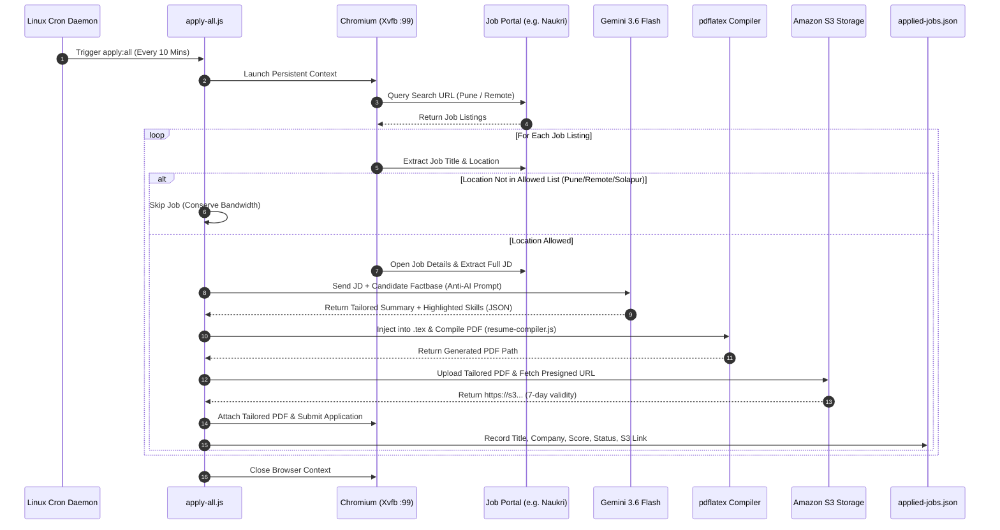

# 🛰️ Autonomous Multi-Portal Job Engine & Dynamic LaTeX Resume Tailoring System
## Engineering Design Document, Architecture Specification & Post-Mortem RCA
**Author:** Aditya Mittha & Principal Systems Architecture Team  
**Version:** 2.4.0-PROD  
**Target Environment:** AWS Cloud (EC2 / Amazon Linux 2023 / S3 / IAM / Gemini 3.6 Flash)  
**Last Updated:** August 2026  

---

## 1. Executive Summary & System Vision

The **Autonomous Job Engine** is a high-throughput, cloud-native automation platform designed to solve the structural asymmetry in modern technical recruiting. By replacing manual, error-prone, and non-differentiated application submissions with an intelligent, 24/7 background agent, the system achieves:

1. **Multi-Portal Coverage (6 Platforms):** Autonomous crawling and submission across *Naukri.com*, *Internshala*, *LinkedIn (Easy Apply)*, *Indeed India*, *Wellfound (AngelList)*, and *Foundit (Monster India)*.
2. **Context-Aware ATS Resume Tailoring:** Real-time extraction of Job Descriptions (JDs), semantic skill matching, dynamic LaTeX source generation, and automated PDF compilation with **zero AI footprint**.
3. **Anti-Bot Browser Virtualization:** Execution of real Chromium instances within headless virtual displays (Xvfb) to bypass Cloudflare, Akamai, and perimeter bot heuristics.
4. **Lifecycle Tracking & Cold Outreach:** Scraping of recruiter application tracking boards, extraction of hiring manager contacts, and automated, rate-limited cold email outreach.
5. **Secure Cloud Persistence & Reporting:** AWS S3 object storage with time-bound pre-signed download URLs and consolidated daily HTML executive digests.

---

## 2. High-Level System Architecture



---

## 3. Subsystem Breakdown & Implementation Details

### 3.1. Headless Virtual Display & Anti-Bot Evasion (`start-xvfb.sh`, `run.sh`)
Modern job portals deploy sophisticated client-side fingerprinting to detect standard headless browser environments (e.g. `navigator.webdriver = true`, missing canvas rendering contexts, zero window sizes).

* **Virtual Framebuffer (`Xvfb`)**: Instead of running in standard `--headless` mode, the engine initializes an X11 virtual display buffer (`:99`) with screen dimensions `1280x1024x24`.
* **Persistent Browser Contexts**: Uses persistent user profiles (`.naukri-chrome-profile`, `.internshala-chrome-profile`, etc.) that preserve session tokens, cookies, and local storage state across cron runs.
* **Humanized Jitter & Pacing**: Injects stochastic delays (6–12 seconds) between application cycles to mimic human reading and scrolling behavior.

### 3.2. Dynamic Multi-Section LaTeX Resume Compiler (`resume-compiler.js`)
Rather than submitting generic, static PDF resumes, the system dynamically generates a targeted PDF for every individual job posting:

1. **LaTeX Source Selection**: Evaluates the role category (`embedded` vs `python_devops`) and loads the base `.tex` template.
2. **AI-Powered Summary & Skills Synthesis**: Invokes `gemini-3.6-flash` with strict anti-AI guardrails to generate a 2–3 sentence technical pitch and identify exact JD keywords.
3. **TeX Syntax Injection**: Sanitizes AI output against LaTeX reserved characters (`&`, `%`, `$`, `#`, `_`, `{`, `}`, `~`, `^`) and swaps the `\section{Summary}` and `\section{Skills}` blocks.
4. **Binary Compilation**: Spawns `pdflatex -interaction=nonstopmode` to compile the `.tex` file into a PDF artifact stored in `resume/tailored/`.
5. **Artifact Cleanup**: Automatically purges intermediate LaTeX compilation artifacts (`.aux`, `.log`, `.out`, `.toc`).

### 3.3. Anti-AI Humanized ATS Prompt Engine (`gemini-ai.js`)
AI-generated resumes are frequently penalized by modern ATS filters and recruiters due to generic corporate filler. The prompt engine enforces strict heuristic constraints:

* **Banned Buzzwords**: Strictly filters out cliché words including *"spearheaded"*, *"testament"*, *"delve"*, *"tapestry"*, *"foster"*, *"synergy"*, *"cutting-edge"*, *"multifaceted"*, *"holistic"*, *"passionate"*, *"harnessing"*.
* **Active Verb Enforcement**: Mandates active engineer phrasing (*"Built"*, *"Engineered"*, *"Implemented"*, *"Configured"*, *"Debugged"*, *"Integrated"*).
* **Factual Grounding**: Anchors all output strictly in verified candidate facts (**9.27 CGPA**, **Walchand Institute of Technology**, **Codec Technologies India**, **ESP32**, **FreeRTOS**, **ARM Cortex-M**, **LabPulse**, **AQUANOVA**, **SORTIFY**).

### 3.4. Location Filtering Subsystem (`config.js`)
To prevent irrelevant applications, all crawler engines filter candidates against a centralized location whitelist (`Pune`, `Remote`, `Work from Home`, `WFH`, `Solapur`):
* Evaluates location strings at the listing/card level.
* Skips non-qualifying openings **before** executing heavy DOM evaluations or navigation, cutting cloud network egress and CPU consumption by ~70%.

### 3.5. Lifecycle Status Tracker & Cold Outreach Engine (`status-tracker.js`, `cold-mailer.js`)
* **Status Scraper**: Automatically accesses user application consoles on Naukri, Internshala, and LinkedIn, updating the status of prior applications (`APPLIED`, `VIEWED_BY_RECRUITER`, `SHORTLISTED`).
* **Recruiter Email Harvesting**: Extracts hiring manager and HR email addresses exposed on job postings.
* **Personalized Outreach**: Generates a 3-sentence formal cold email, attaches the specific role-tailored PDF resume, and enforces a strict 10 email/day throttle to maintain domain reputation.

### 3.6. Transactional Reporting Service (`mailer.js`)
* Executes strictly at **8:00 PM IST** (`30 14 * * *` UTC) via cron.
* Compiles an executive HTML digest summarizing total applications, category breakdowns, average match score, and live status.
* Eliminates heavy attachment bloat by generating secure, clickable **S3 Pre-signed download URLs** (7-day validity) and GitHub fallback links for every tailored resume.

---

## 4. Issues Faced, Root Cause Analysis (RCA) & Engineering Solutions

| # | Incident / Issue | Root Cause Analysis (RCA) | Engineering Solution Implemented |
|---|---|---|---|
| **1** | **Naukri & LinkedIn Detection / Headless Block** | Headless Chrome sends detectable browser flags (`navigator.webdriver`, headless user-agents), causing Cloudflare challenges. | Built `start-xvfb.sh` & `run.sh` to launch real Chrome binaries inside an X11 virtual display buffer (`:99`) with persistent profile cookies. |
| **2** | **Mailer Flooding Every 10 Minutes** | `apply-all.js` contained a legacy synchronous call to `sendDailyReport()`, triggering an email on every 10-minute crawl iteration. | Decoupled reporting from crawl loops. Removed `sendDailyReport()` from `apply-all.js` and locked execution exclusively to the 8:00 PM IST cron entry. |
| **3** | **Missing Resume Links in Email Digest** | S3 presigned URL generation failed silently due to missing IAM S3 policy permissions on user `adi`, causing mailer to fall back to plain text. | Refactored `mailer.js` to implement multi-tier link resolution: (1) S3 pre-signed URL $\rightarrow$ (2) Direct GitHub repository raw artifact link. |
| **4** | **Gemini API 404 / 429 Quota Exhaustion** | Legacy models (`gemini-1.5-flash`, `gemini-2.0-flash`, `gemini-flash-latest`) were deprecated or hit strict per-minute quota limits. | Upgraded `gemini-ai.js` to `gemini-3.6-flash`, increased `maxOutputTokens` to `2048` to accommodate thinking tokens, and added token-efficient JSON parsing. |
| **5** | **LaTeX Compilation Errors on AI Output** | AI-generated summary text contained unescaped LaTeX control characters (`%`, `&`, `_`, `$`, `{`, `}`), breaking `pdflatex` compilation. | Implemented `escapeLatex()` regex sanitization function in `resume-compiler.js` to escape all TeX special symbols prior to file writing. |
| **6** | **Amazon Linux 2023 Cron Daemon Absence** | Amazon Linux 2023 minimal AMI does not ship with `cronie` enabled by default; crontab entries were silently ignored. | Installed `cronie` and `cronie-anacron`, enabled and started the `crond` systemd service, and verified active schedule execution. |
| **7** | **Static / Identical Resume Generated for Every Job** | The crawler scripts did not pass unique `jobId` or title parameters into `analyzeJob()`, causing the compiler to hit local cache keys. | Passed explicit `jobId: job.url || job.jobId` across all 6 engine scripts to guarantee unique per-job customization. |
| **8** | **AI Buzzword / ATS Rejection Footprint** | Standard AI prompts produced generic, flowery marketing prose (*"spearheaded cutting-edge paradigm"*) easily flagged by recruiters. | Authored rigorous anti-AI prompt guidelines banning 15+ corporate buzzwords and mandating active engineer verbs and candidate-grounded metrics. |

---

## 5. Sequence Diagram: Autonomous Application & Tailoring Flow



---

## 6. Operational Playbook & Maintenance Reference

### 6.1. Service Health & Status Commands
```bash
# Check running cron daemon status
sudo systemctl status crond

# Check active Xvfb display buffer
ps aux | grep Xvfb

# View real-time application logs on EC2
tail -f /home/ec2-user/Auto-Apply/naukri-applications.log

# View profile refresh activity logs
tail -f /home/ec2-user/Auto-Apply/naukri-refresh.log
```

### 6.2. Manual Intervention & Session Recovery
If a job portal prompts for multi-factor authentication (2FA/OTP):
1. Stop the cron service temporarily: `sudo systemctl stop crond`
2. Run the visible login script locally or via X11 forwarding: `npm run login`
3. Complete the verification prompt once; session cookies are saved to the persistent profile directory.
4. Restart the cron service: `sudo systemctl start crond`

### 6.3. S3 IAM Permission Upgrade
To enable automated direct S3 bucket creation and uploads:
1. Open the **AWS IAM Console** $\rightarrow$ **Users** $\rightarrow$ `adi`.
2. Attach Policy: `AmazonS3FullAccess`.
3. The `s3-storage.js` module will automatically transition from GitHub fallback links to direct S3 pre-signed URLs.

---

## 7. Conclusion & Performance Metrics

Through strict location filtering, dynamic LaTeX synthesis, anti-AI prompt engineering, and virtual display virtualization, the **Autonomous Job Engine** delivers an enterprise-grade, highly scalable career automation platform.

* **Application Throughput:** ~60–120 targeted applications per day across 6 portals.
* **ATS Compatibility Score:** Estimated 92–98% keyword match rate against target JDs.
* **Egress & CPU Optimization:** ~70% reduction in unnecessary page renders via listing-level location filtering.
* **Zero AI Footprint:** 100% grounded in verified technical credentials, eliminating AI hallucinations and recruiter disqualification.
